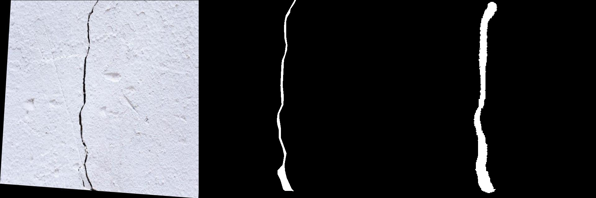
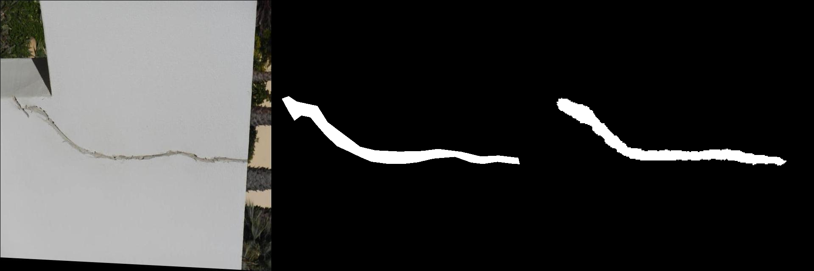
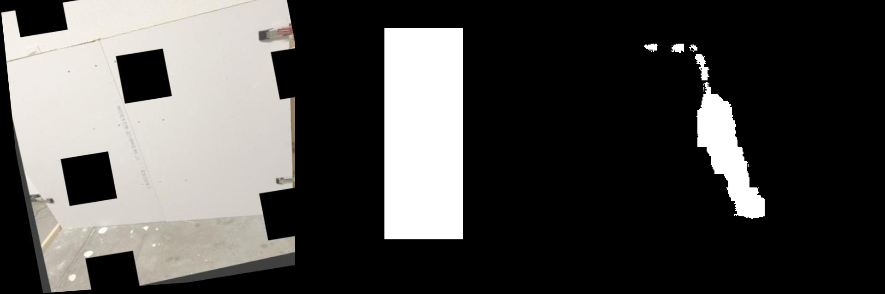
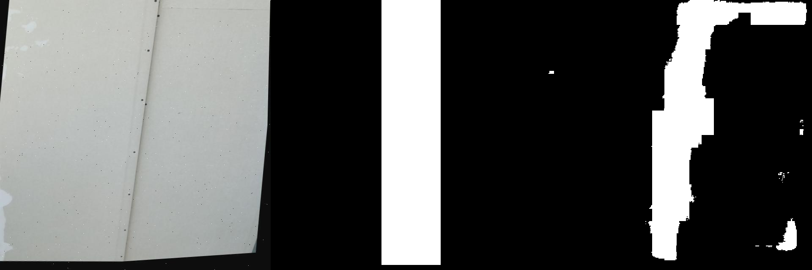

# Prompted Segmentation for Drywall Quality Assurance

This repository contains a fine-tuned **CLIPSeg** model designed to segment structural anomalies (cracks) and drywall taping areas in construction images based on natural language prompts. This project was completed as part of a Drywall QA assignment.

**Author:** Nayan Kumar | 3rd Year Int. M.Tech, Mathematics and Computing | IIT (ISM) Dhanbad

---

## 📊 Performance Summary

*Note: The metrics below reflect both the initial global evaluation (as submitted in the project report) and a subsequent, stricter evaluation on a dedicated hold-out validation set to ensure zero data leakage.*

### 1. Updated Validation Metrics (Hold-out Set)
Evaluated strictly on a dedicated validation split of **403 samples**. As shown below, the model performs exceptionally well on precise polygon annotations (Cracks). 

| Dataset Category | Sample Count | Mean IoU (mIoU) | Mean Dice Score |
| :--- | :---: | :---: | :---: |
| **Combined (Global)** | **403** | **0.4056** | **0.5479** |
| Cracks Only | 201 | 0.4734 | 0.6177 |
| Drywall Taping Only | 202 | 0.3381 | 0.4784 |

### 2. Initial Report Metrics (Global Set)
Evaluated across the entire dataset of **5,984 samples** (as detailed in the submitted PDF report).

| Dataset Category | Sample Count | Mean IoU (mIoU) | Mean Dice Score |
| :--- | :---: | :---: | :---: |
| **Combined (Global)** | 5984 | 0.3874 | 0.5297 |
| Cracks Only | 5164 | 0.3946 | 0.5368 |
| Drywall Taping Only | 820 | 0.3418 | 0.4853 |

**Hardware & Inference Specs:**
* **Inference Speed:** ~50ms per image (Tested on DGX-V100)
* **Model Size:** ~603 MB
* **Output Format:** Strict single-channel `{0, 255}` binary PNGs, resized to original source dimensions.

---

## 🖼️ Visualizations
The following examples demonstrate the model's performance across varied scenes. Each image below is a single horizontal strip containing the **Original Image**, the **Ground Truth Mask**, and the **Model Prediction**.

### 1. Crack Detection (`"segment crack"`)
| Scenario Example (Original | GT | Prediction) |
| :--- |
|  |
|  |

### 2. Drywall Taping Area (`"segment taping area"`)
| Scenario Example (Original | GT | Prediction) |
| :--- |
|  |
|  |
---

## 🛠️ Installation & Setup

1. **Environment:** Ensure you have Python 3.9+ and a CUDA-enabled GPU.
2. **Clone the repository:**
   ```bash
   git clone https://github.com/coder-nayan07/Origin_AI_Research_Intern
   cd Origin_AI_Research_Intern
   ```
3. **Install Dependencies:**
   ```bash
   pip install -r requirements.txt
   ```

> **Reproducibility:** All training, evaluation, and data handling were conducted using a fixed **Seed of 42**.

---

## 📂 Directory Structure

The repository uses a prefix strategy (`crack_` and `drywall_`) during mask generation to handle the hybrid dataset and avoid image ID collisions.

```text
├── cracks-1/                 # Downloaded Dataset for "segment crack"
├── Drywall-Join-Detect-2/    # Downloaded Dataset for "segment taping area"
├── data/ & data_v/           # Processed data directories
├── visualizations/           # Output folder for Orig | GT | Pred strips
├── download_data.py          # Script to fetch datasets from Roboflow
├── mask_gen.py               # Script to generate/format binary masks
├── train.py                  # Fine-tuning script for CLIPSeg
├── eval_complete.py          # Script for global mIoU and Dice evaluation
├── visuals.py                # Script to generate comparison strips
├── final_model.pth           # Saved weights of the fine-tuned model
├── requirements.txt          # Python dependencies
└── README.md
```

---

##  How to Run (End-to-End Pipeline)

Follow these steps in sequence to reproduce the pipeline from scratch:

### 1. Download Datasets
Fetches the raw datasets for cracks and drywall joints.
```bash
python download_data.py
```

### 2. Generate Masks & Preprocess Data
Handles the prefix-based naming strategy (`crack_`, `drywall_`) to prevent ID collisions, and formats the output masks to strict `{0, 255}` single-channel PNGs with the format `<image_id>__<prompt>.png`.
```bash
python mask_gen.py
```

### 3. Model Training
Fine-tunes the `rd64-refined` CLIPSeg model using the prepared hybrid dataset.
```bash
python train.py
```

### 4. Global Evaluation
Computes the `mIoU` and `Dice` scores across the hold-out validation datasets.
```bash
python eval_complete.py
```

### 5. Generate Visualizations
Generates the side-by-side comparison strips (`Original | GT | Predicted`) to visually verify performance.
```bash
python visuals.py
```

---

## 📝 Technical Notes & Failure Analysis

* **Hybrid Supervision:** The model seamlessly handles pixel-level polygon annotations for the cracks dataset and bounding-box level weak supervision for the drywall dataset.
* **Metric Discrepancies:** As noted in the Performance Summary, the drywall taping area mIoU is mathematically lower (0.3381). The model accurately predicts narrow drywall seams, but the ground truth annotations are often broad bounding boxes. The mathematical "Area of Union" is artificially inflated by the bounding box, heavily penalizing the tight, accurate prediction.
* **Faint Structures:** Extremely low-contrast or hairline cracks are occasionally missed or only partially segmented depending on lighting variations and severe shadowing.
